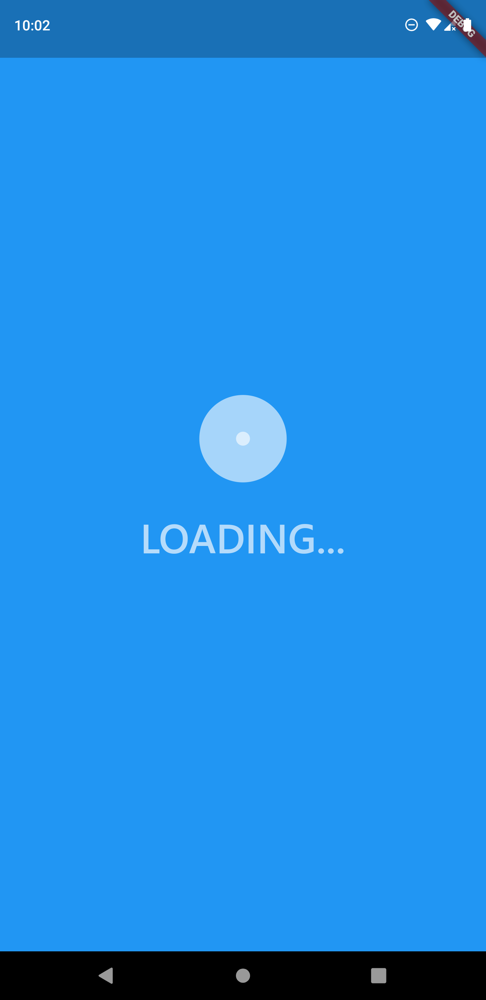
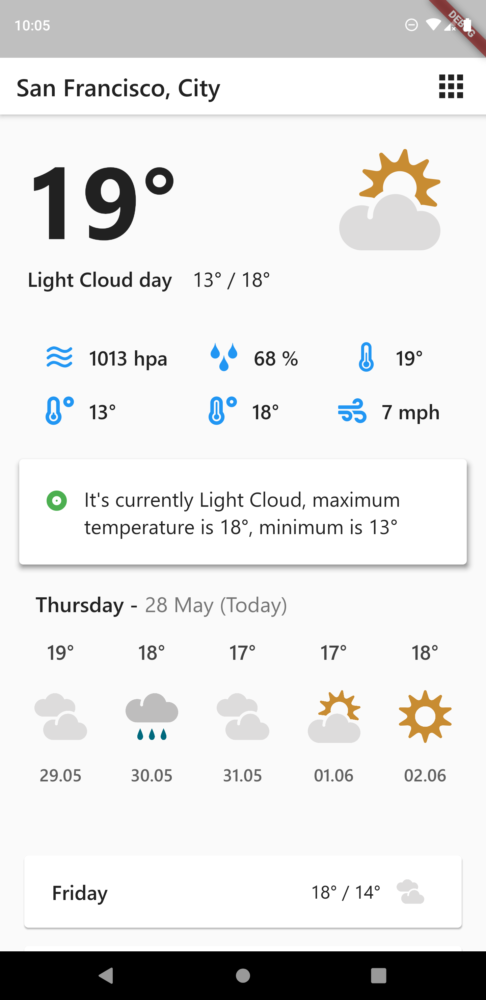
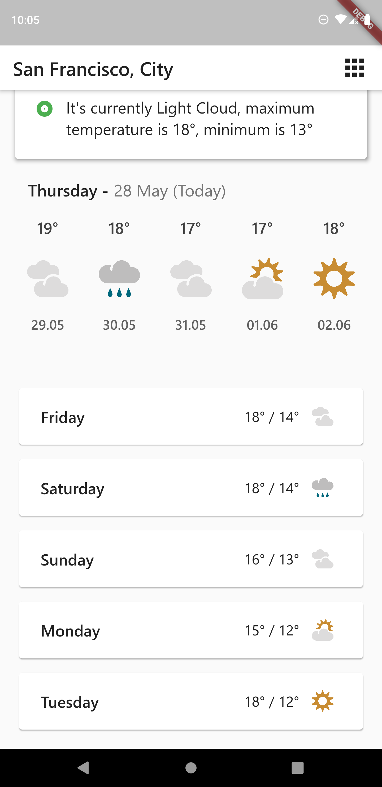
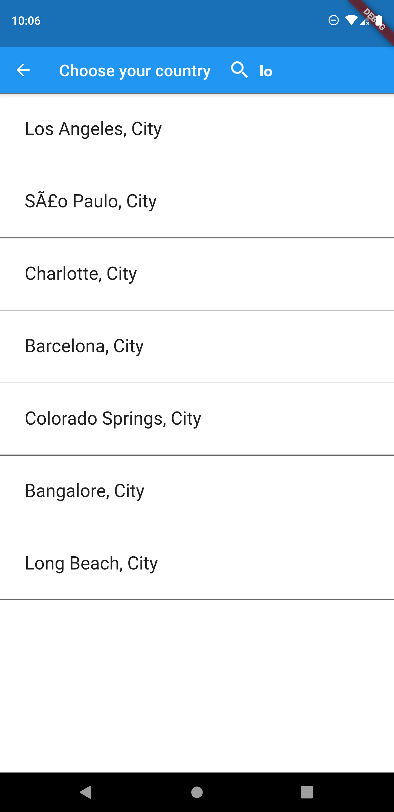
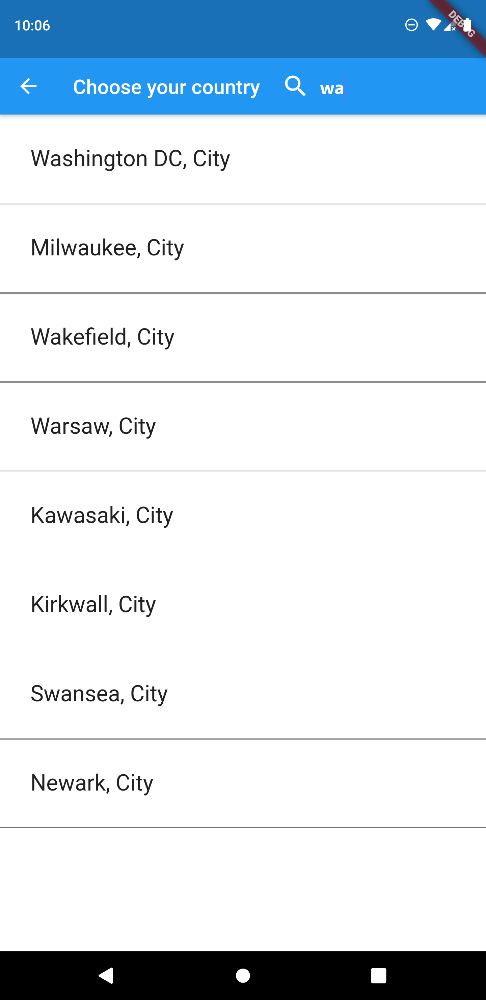

# Weather app in flutter

#### Weather app for capital cities based on metaweather API

## Getting Started

#### Used features: 
- flutter material design library
- metaweather open API  [link](https://www.metaweather.com/api/)
- flutter spin kit library [link](https://pub.dev/packages/flutter_spinkit)
- flutter animated text kit library [link](https://pub.dev/packages/animated_text_kit)
- flutter http library [link](https://pub.dev/packages/http)
- flutter date format library [link](https://pub.dev/packages/date_format)
- flutter intl library [link](https://pub.dev/packages/intl)

### App was created in flutter language which is based on dart.

#### Used technology
- async tasks
- get data from api
- build listview
- build gridview
- used maps and lists
- used navigator component
- search in list of dynamic objects
- custom classes and widgets

## Screenshots :

## Thanks for reading. Don't forget to star my project 
